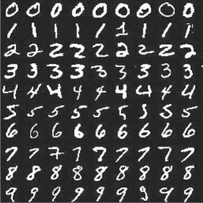
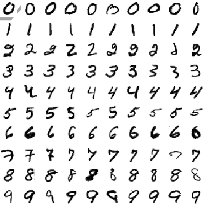

# 🤖 Machine Learning Experiments

Collection of interactive machine-learning experiments.

## Demo

@TODO: Add demo link and instructions: http://trekhleb.github.io/machine-learning-experiments

## Experiments

|         | Experiment | Model usage | Model training | Topics |
| ------- | ---------- | ----------- | -------------- | ------ |
|  | **Handwritten digits recognition (MLP)** | [▶️ Demo](https://trekhleb.github.io/machine-learning-experiments/experiments/DigitsRecognitionMLP) ️| [](https://nbviewer.jupyter.org/v2/gh/trekhleb/machine-learning-experiments/blob/master/experiments/digits_recognition_mlp/digits_recognition_mlp.ipynb) [](https://colab.research.google.com/github/trekhleb/machine-learning-experiments/blob/master/experiments/digits_recognition_mlp/digits_recognition_mlp.ipynb)‍️ | MLP, Tensorflow |
|  | **Handwritten digits recognition (CNN)** | [▶️ Demo](https://trekhleb.github.io/machine-learning-experiments/experiments/DigitsRecognitionCNN) ️| [](https://nbviewer.jupyter.org/v2/gh/trekhleb/machine-learning-experiments/blob/master/experiments/digits_recognition_cnn/digits_recognition_cnn.ipynb) [](https://colab.research.google.com/github/trekhleb/machine-learning-experiments/blob/master/experiments/digits_recognition_cnn/digits_recognition_cnn.ipynb) ️‍| CNN, Tensorflow |

[](https://nbviewer.jupyter.org/v2/gh/trekhleb/machine-learning-experiments/blob/master/experiments/digits_recognition_mlp/digits_recognition_mlp.ipynb)
[](https://colab.research.google.com/github/trekhleb/machine-learning-experiments/blob/master/experiments/digits_recognition_mlp/digits_recognition_mlp.ipynb)

[](https://nbviewer.jupyter.org/v2/gh/trekhleb/machine-learning-experiments/blob/master/experiments/digits_recognition_cnn/digits_recognition_cnn.ipynb)
[](https://colab.research.google.com/github/trekhleb/machine-learning-experiments/blob/master/experiments/digits_recognition_cnn/digits_recognition_cnn.ipynb)

<table>
  <thead>
    <tr>
      <th>&nbsp;</th>
      <th>Experiment</th>
    </tr>
  </thead>
  <tbody>
      <tr>
        <td>
          
        </td>
        <td>
          <b>Handwritten digits recognition (MLP)</b>
        </td>
      </tr>
      <tr>
        <td>3</td>
        <td>4</td>
      </tr>
  </tbody>
</table>

### Handwritten digits recognition (MLP)

Handwritten digits recognition using Multilayer Perceptron (MLP).

#### ▶️ Interactive Demo

 [▶️ Launch demo](https://trekhleb.github.io/machine-learning-experiments/experiments/DigitsRecognitionMLP)

#### 🏋 Model Training

[](https://nbviewer.jupyter.org/v2/gh/trekhleb/machine-learning-experiments/blob/master/experiments/digits_recognition_mlp/digits_recognition_mlp.ipynb)
[](https://colab.research.google.com/github/trekhleb/machine-learning-experiments/blob/master/experiments/digits_recognition_mlp/digits_recognition_mlp.ipynb)

## How to use this repository

### Virtual environment for Experiments

This environment is used to run Jupyter notebooks with experiments. This environment is used by default for further documentation. If some commands need to be run in another environment (i.e. in `convertor` environment) this will be specified explicitly.

#### Create environment for Experiments

```bash
python3 -m venv .virtualenvs/experiments
```

#### Activate environment for Experiments

For `shell`:

```bash
source .virtualenvs/experiments/bin/activate
```

For `fish`:

```bash
source .virtualenvs/experiments/bin/activate.fish
```

### Virtual environment for Model Convertor

This environment is used to convert the models that were trained during the experiments from `.h5` format to Javascript understandable formats (`.json` and `.bin`) for further usage in Demo application.

#### Create environment for Converter

```bash
python3 -m venv .virtualenvs/convertor
```

#### Activate environment for Convertor

For `shell`:

```bash
source .virtualenvs/convertor/bin/activate
```

For `fish`:

```bash
source .virtualenvs/convertor/bin/activate.fish
```

### Quitting virtual environments

```bash
deactivate
```

### Upgrading `pip`

```bash
pip install --upgrade pip
```

### Add new package (optional)

```bash
pip install package
```

### Save added package to `requirements.txt`

```bash
pip freeze > requirements.txt
```

To list installed packages for convertor environment you should launch:

```bash
pip freeze > requirements.convertor.txt
```

### Install packages

```bash
pip install -r requirements.txt
```

To install packages in `convertor` environment run:

```bash
pip install -r requirements.convertor.txt
```

### Launching Jupyter

```bash
jupyter notebook
```

### Converting the models

To convert `.h5` model to `.json` and `.bin` formats for further usage in JavaScript Demos you should run:

```bash
tensorflowjs_converter --input_format keras path/to/my_model.h5 path/to/tfjs_target_dir
```

For example:

```bash
tensorflowjs_converter --input_format keras \
  ./experiments/digits_recognition_mlp/digits_recognition_mlp.h5 \
  ./demos/public/models/digits_recognition_mlp
```

### Launching demos locally

```bash
cd demos
yarn install
yarn start
```
